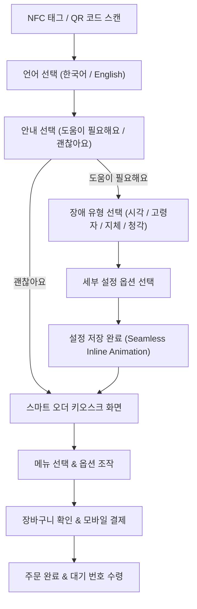

# 📱 모바일 키오스크 대체 플랫폼 (Mobile Kiosk Replacement Platform)

> **핵심 정의**: 물리적 키오스크의 접근성 한계(높이 조작 불능, 시각장애인 이용 불가, 복잡한 UI)를 극복하기 위해, 사용자의 개인 스마트폰(BYOD)으로 매장 주문을 100% 대체하는 **배리어프리 모바일 스마트 오더 플랫폼**입니다.

---

## 1. 기존 실물 키오스크의 문제점과 대체 플랫폼의 필요성

| 구분 | 기존 실물 키오스크 (Physical Kiosk) | 모바일 키오스크 대체 플랫폼 (Mobile BYOD Platform) |
| :--- | :--- | :--- |
| **물리적 높이** | 화면이 높아 휠체어 이용자·어린이 조작 불가 | 개인 스마트폰으로 편안한 자세와 높이에서 조작 |
| **시각장애인 접근성** | 점자/음성 안내 미비, 화면 터치 불가 | OS 점자/스크린리더(VoiceOver/TalkBack) 및 AI 음성주문 지원 |
| **개인화 설정** | 매번 키오스크에서 설정을 처음부터 조정해야 함 | 개인 스마트폰의 접근성 설정(글씨 크기, 고대비) 자동 연동 |
| **설치 & 유지보수** | 고가의 전용 단말기 도입비 및 수리 비용 | NFC/QR 스마트 태그만 배치하여 도입 비용 극대화 절감 |

---

## 2. 핵심 접근성 UX 및 기술 구조

### 1) 이중 음성 지원 체계 (Dual Speech Architecture)
- **OS Native VoiceOver / TalkBack 지원 (WAI-ARIA)**:
  - 시각장애인 사용자가 본인 스마트폰의 OS 스크린리더를 켠 상태로 접속할 경우, 모든 버튼과 폼 요소에 부여된 `aria-label`, `role`, `aria-live` 속성을 통해 초점을 이동하며 정확히 읽어줍니다.
- **앱 자체 Web TTS (Web Speech API)**:
  - OS 스크린리더 제스처에 익숙하지 않은 고령자, 저시력자, 디지털 약자를 위해 화면 전환 시 즉시 주요 안내 문구를 자동으로 읽어줍니다.
- **AI 음성 주문 (Speech-to-Text)**:
  - 손 조작이 어렵거나 눈이 보이지 않는 사용자가 "아메리카노 1잔 주문해 줘"라고 말하면 자동으로 메뉴 탐색 및 장바구니 담기를 실행합니다.

### 2) 4대 맞춤형 배리어프리 프로필 (Preset Profiles)
1. **시각 장애 (Visual)**: 음성 스크린리더, 200% 글씨 확대, 고대비, 색각 보안 패턴, 다크 모드.
2. **고령자 / 난독증 (Cognitive & Elderly)**: 쉬운 단어, 자간/줄간격 확대, 큰 글씨, 처리 시간 제한 해제.
3. **지체 장애 (Mobility)**: 하단 화면 집중 배치(Wheelchair mode), 터치 오작동 방지(Debounce delay), 큰 버튼 모드.
4. **청각 장애 (Hearing)**: 모든 음성 안내를 시각적 팝업 및 진동(Haptic) 피드백으로 즉시 대체.

---

## 3. 디자인 시스템 (Design System)

- **메인 브랜드 컬러**: Toss Blue (`#3182f6`)
- **타이포그래피**: Pretendard Variable (가독성 특화 시스템 서체)
- **디자인 원칙**: 
  - 불필요한 장식 요소, 중첩된 외각 상자 및 그라데이션 제거.
  - 명확한 대비와 대형 터치 타겟(`min-h-[64px] ~ min-h-[76px]`) 적용.
  - 심플한 단일 문장 안내로 정보 전달력 극대화.

---

## 4. 모바일 주문 프로세스 (User Flow)

---

## 5. 결론 및 향후 확장성

본 모바일 키오스크 대체 플랫폼은 **실물 기기 도입 없이 스마트폰 하나만으로 매장의 모든 고객이 차별 없이 주문할 수 있는 지속 가능한 디지털 배리어프리 환경**을 제공합니다.
